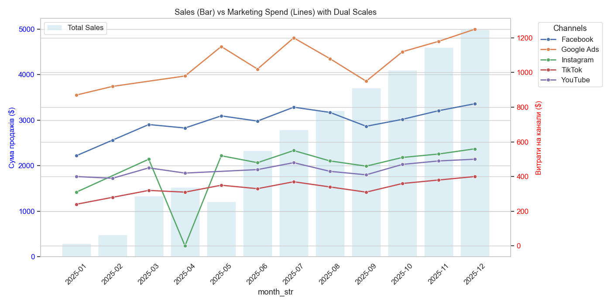

# Executive Summary: Marketing Performance & Sales Analysis (FY2025)

## 1. Візуалізація результатів
Нижче наведено порівняння загальних продажів (бари) та витрат на маркетинг за каналами (лінії).

*Рис 1. Динаміка продажів та маркетингових інвестицій (січень–грудень 2025)*

---

## 2. Key Findings
* **Експоненціальне зростання виручки (MoM):** За підсумками звітного періоду зафіксовано стабільний тренд зростання. Виручка збільшилась із ~$300 у січні до **$5000 у грудні**, що свідчить про високу ефективність масштабування в Q4.
* **Домінантні канали за бюджетом:** **Google Ads** стабільно залишається каналом з найбільшими інвестиціями (пік >$1200 у грудні), за ним слідує **Facebook**.
* **Ефективність каналів:** Попри нижчі бюджети, канали **Instagram** та **YouTube** демонструють стабільну динаміку, проте Instagram мав критичне падіння активності у квітні (2025-04).

## 3. Anomalies & Trends
* **Маркетингова аномалія (квітень):** Різке падіння витрат по каналу **Instagram** у квітні до значень, близьких до нуля. Це могло бути викликано технічним збоєм кабінету або зміною стратегії, що сповільнило темпи росту продажів у цей місяць.
* **Сезонне прискорення:** Починаючи з вересня (2025-09), спостерігається корельоване зростання витрат по всіх каналах одночасно з різким стрибком загальних продажів.
* **Стабільність TikTok:** Канал TikTok показує найбільш плавне зростання витрат без різких коливань, що робить його найбільш прогнозованим інструментом.

## 4. Business Impact
* **Ризики концентрації:** Велика залежність від **Google Ads** (помаранчева лінія). Ефективність всього маркетингового міксу наразі сильно прив'язана до вартості кліка в цій мережі.
* **Кореляція витрати/дохід:** Графік чітко показує, що зростання сумарних витрат у другому півріччі призвело до кратного збільшення виручки, що підтверджує позитивний ROI масштабування.

## 5. Recommendations
* **Media Mix Optimization:** Продовжити агресивне масштабування **Google Ads**, але почати диверсифікацію в бік **Facebook**, який показує високу стабільність.
* **Investigation:** Провести аудит активності в **Instagram** за квітень 2025 року, щоб уникнути подібних провалів у майбутньому.
* **Budget Allocation:** Розглянути можливість збільшення бюджету на **TikTok** у періоди низької активності Google Ads для збалансування CAC (вартості залучення клієнта).